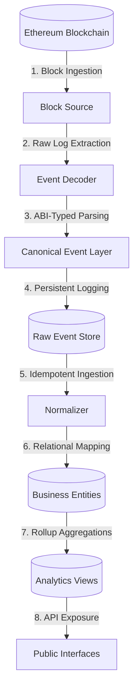

# ARCHITECTURE.md: Engineering Specification for `sera-data`

This document defines the long-term vision, core engineering principles, system architecture, data models, recovery patterns, and package guidelines for `sera-data`—the open-source indexing and analytics platform for the Sera Protocol. All future contributors must read and align with this specification before proposing design changes or writing implementation code.

---

## 1. Vision

### What is `sera-data`?
`sera-data` is an open-source, high-performance, and fully deterministic data indexing and analytics platform for the Sera Protocol. It ingests raw logs and transaction data directly from the Ethereum blockchain, parses and normalizes them, and exposes a high-throughput, type-safe API for developers, AI agents, and dashboards.

### Why does it exist?
The Sera Protocol relies on an off-chain Central Limit Order Book (CLOB) and off-chain execution services to match trades at sub-second speeds. However, the ultimate settlement of every trade, deposit, and withdrawal occurs on-chain via smart contracts. 

Because the public Sera REST API relies on polling and off-chain databases, there is no public, real-time, or historically queryable system that allows developers to:
*   Compute historical, verifiable TVL statistics.
*   Monitor execution slippage (comparing off-chain quotes against on-chain matches).
*   Verify executor performance, settlement latency, and batching efficiency.
*   Build custom, high-speed dashboards or trigger real-time actions for AI agents without hitting API rate limits.

`sera-data` fills this gap by providing a self-hostable, open-source daemon and API stack that gives anyone the capability to run their own analytics nodes.

### What problem does it solve?
1.  **Trust-Minimized Analytics:** Eliminates reliance on centralized APIs by reconstructing the protocol's state directly from on-chain logs.
2.  **Developer Experience:** Exposes a rich GraphQL and REST query gateway, reducing developer integrations from complex web3 polling loops to simple GraphQL subscriptions.
3.  **Capital Efficiency Audits:** Empowers market makers and researchers to analyze virtual liquidity patterns and track execution slippage.

---

## 2. Engineering Principles

Every architectural design decision in `sera-data` must adhere to these seven core principles:

1.  **Blockchain is the Source of Truth:** The on-chain records of `Vault.sol`, `Sera.sol`, `SeraSOR.sol`, and `SeraBatcher.sol` are the absolute and immutable records of truth. Off-chain database tables must always be reconcilable with the chain.
2.  **Events are Immutable:** Once an event is fetched from a block and written to the store, it must never be modified. All updates to downstream entities are downstream projections of these immutable events.
3.  **Analytics are Derived:** Derived metrics (e.g., TVL, daily volume, active users) must never be updated as inline fields inside transactional tables. They must reside in separate, materialized tables or views calculated asynchronously from raw event records.
4.  **Every Operation must be Replayable:** If the database is dropped, the system must be capable of reconstructing the exact state of the world from genesis by re-streaming on-chain blocks and logs in sequential order.
5.  **Idempotent Processing:** Downstream normalizers, database triggers, and aggregation tasks must be idempotent. Re-indexing the same block or event twice must not alter the final state of the database.
6.  **Stateless Workers:** The indexer and API application services must remain completely stateless. They must rely solely on the database and cache for state, allowing them to be scaled horizontally inside container environments.
7.  **Deterministic Indexing:** The state generated by the indexer must be deterministic. Given the same block range and initial database state, any node running `sera-data` must output the exact same database records.

---

## 3. System Architecture

The data pipeline in `sera-data` is structured into nine distinct layers, separating concerns and ensuring that ingestion errors do not contaminate downstream business logic.



### Responsibility of Every Layer

1.  **Blockchain:** The network layer. Exposes raw logs, receipt parameters, and transaction details via JSON-RPC.
2.  **Block Source:** Subscribes to RPC block filters and polls for head changes. Its responsibility is to monitor block heights and handle network disconnects or JSON-RPC timeouts.
3.  **Event Decoder:** Matches block logs against known contract ABIs (`Vault`, `Sera`, `SeraSOR`). It parses raw hexadecimal topics and data into structured JavaScript objects.
4.  **Canonical Event Layer:** Translates ABI-specific event shapes into standardized TypeScript types. It removes EVM-specific details (like raw `uint256` bigints with 18 decimals) and formats them into a normalized internal protocol format.
5.  **Raw Event Store:** A persistent log in PostgreSQL that records every canonical event exactly as it was received, alongside its block number, transaction index, and log index. It acts as the local write-ahead log (WAL) for state reconstruction.
6.  **Normalizer:** A service that consumes events sequentially from the Raw Event Store and updates relational business tables.
7.  **Business Entities:** The transactional relational database layer. Contains structured tables (`users`, `tokens`, `markets`, `trades`, `swaps`, `deposits`, `withdrawals`).
8.  **Analytics Layer:** Consists of continuous materialized views (configured via TimescaleDB) and dbt-like hourly/daily rollup tables. Responsible for compiling complex metrics such as TVL, active trader DAU/MAU, and corridor volumes.
9.  **Public Interfaces:** The gateway layer. Exposes GraphQL resolvers, REST routes, and server-sent events (SSE) to external clients.

---

## 4. Canonical Event Model

### Why we do NOT expose raw Ethereum logs internally
Raw Ethereum logs are complex, EVM-dependent, and prone to breaking changes when contract version upgrades occur. They use low-level hex string formats, require heavy type-casting (converting hex to BigInt, scaling decimals), and contain contract-specific variables that do not map directly to business logic.

By isolating raw logs at the boundary, we prevent blockchain-specific quirks from leaking into the core database and API layers. If a contract is upgraded or a new routing library is introduced, we only update the **Event Decoder** and **Canonical Event Layer**; the rest of the application remains unchanged.

### How protocol events become canonical events
1.  **Extraction:** The indexer reads a raw log:
    ```json
    { "topics": ["0x9089d3...", "0x000..."], "data": "0x0000000000..." }
    ```
2.  **Decoding:** The indexer decodes the log using the corresponding ABI:
    ```typescript
    { eventName: "Deposited", args: { token: "0xa0b8...", user: "0xf39...", amount: 1000000n } }
    ```
3.  **Canonical Conversion:** The converter translates the parameters into a standardized JSON model. BigInts are normalized using the token's decimal metadata (e.g., converting USDC with 6 decimals into a standard high-precision float), addresses are checksummed, and block metadata is injected:
    ```typescript
    {
      type: "DEPOSIT",
      payload: {
        tokenAddress: "0xA0b86991c6218b36c1d19D4a2e9Eb0cE3606eB48",
        userAddress: "0xF39Fd6e51aad88F6F4ce6aB8827279cffFb92266",
        amount: "1.000000",
        decimals: 6
      },
      metadata: {
        blockNumber: 19847291,
        transactionHash: "0x3a9b...",
        timestamp: "2026-07-11T14:17:49Z"
      }
    }
    ```

---

## 5. Replay Strategy

Because downstream business tables and analytics are entirely derived, the database must support **replayability**. To rebuild the entire database from genesis:

1.  **Truncate Derived Tables:** Clear all tables *except* `tokens`, `markets`, and `raw_events`.
2.  **Sequential Event Replay:** A background script streams records from the `raw_events` store sorted by `block_number ASC`, `transaction_index ASC`, and `log_index ASC`.
3.  **Idempotent Execution:** For each event, the `Normalizer` executes the corresponding insertion or update query. Because the events are ordered and the database operations are idempotent, the relational tables will be reconstructed to their exact state at any arbitrary block height.
4.  **View Refresh:** Once the replay completes, the system triggers a manual refresh of all materialized analytics views.

*Replay speeds are extremely fast because we avoid RPC network round-trips; we query the locally stored events instead of requesting logs from Ethereum nodes.*

---

## 6. Failure Handling

A production-grade indexer must handle blockchain-specific failures gracefully without manual intervention:

*   **RPC Disconnects:**
    *   *Behavior:* The indexer utilizes a reconnection backoff strategy.
    *   *Action:* If connection is lost, it suspends block processing, attempts to reconnect every 2 seconds (up to 10 retries), and falls back to a secondary RPC endpoint list if defined.
*   **Duplicate Events:**
    *   *Behavior:* Network issues or manually triggered replays can submit duplicate events.
    *   *Action:* The indexer implements strict SQL constraints. Every insert into `raw_events`, `trades`, `deposits`, etc., uses a composite key of `(transaction_hash, log_index)`. Re-inserting an existing key is handled via `ON CONFLICT DO NOTHING` to ensure idempotency.
*   **Chain Reorganizations (Reorgs):**
    *   *Behavior:* Blocks can be orphaned, reverting previously indexed transactions.
    *   *Action:* The indexer maintains a reorg buffer depth (default: 6 blocks). It only processes events that have at least 6 confirmations. For real-time stats, it stores temporary "unconfirmed" events in a separate cache, discarding them if a reorg is detected.
*   **Partial Failures:**
    *   *Behavior:* A single batch execution reverts, or one event processing block fails due to a database lock.
    *   *Action:* Every block's event array is processed inside a single SQL transaction. If one write fails, the entire block's changes are rolled back, and the indexer halts, alerting operators via logging channels.
*   **Restart Recovery:**
    *   *Behavior:* The process is killed unexpectedly.
    *   *Action:* On startup, the indexer queries `SELECT MAX(block_number) FROM raw_events` and resumes scanning from that block height + 1.

---

## 7. Package Responsibilities

The monorepo separates concerns into clean boundary packages:

*   **`apps/indexer`**: Focuses exclusively on running the daemon loops, listening to chain events, and sending them to the database. Contains no business metrics equations or query logic.
*   **`packages/contracts`**: Exposes typed ABIs and addresses. Contains zero database code or network execution libraries.
*   **`packages/database`**: Defines the database schema, migrations, connection configurations, and repository functions.
*   **`packages/shared`**: Contains generic configuration helpers, validation utilities (using Zod), log configurations, and system-wide custom error definitions.

---

## 8. Coding Standards

*   **TypeScript Strict Mode:** `"strict": true` must be enabled. No usage of `any` is allowed; type casting via `as` should be minimized.
*   **Biome Formatting:** All code must pass Biome linting and formatting. Run `pnpm run lint` before committing.
*   **ESM Modules:** The project compiles to ECMAScript Modules (ESM) to support modern Node.js features.
*   **Decoupled Database Logic:** No SQL queries should be written directly inside application files. All queries must reside in repository classes within `packages/database`.
*   **Error Handling:** Use custom typed errors inheriting from a base `SeraError` class. Never swallow exceptions; always log the context and stack trace.

---

## 9. Contribution Philosophy

1.  **Clean Code Over Clever Code:** Write readable, self-documenting code. Avoid hyper-optimization unless supported by benchmark profiles.
2.  **No Code Without Tests:** Every new feature, parser, or database repository function must be accompanied by unit tests in Vitest.
3.  **Documentation Integration:** If a change modifies configurations, API schemas, or deployment targets, update the corresponding markdown file in the repository.
4.  **PR Discipline:** Pull requests should be scoped to a single feature or bug fix. Avoid massive, multi-package changesets unless necessary.
