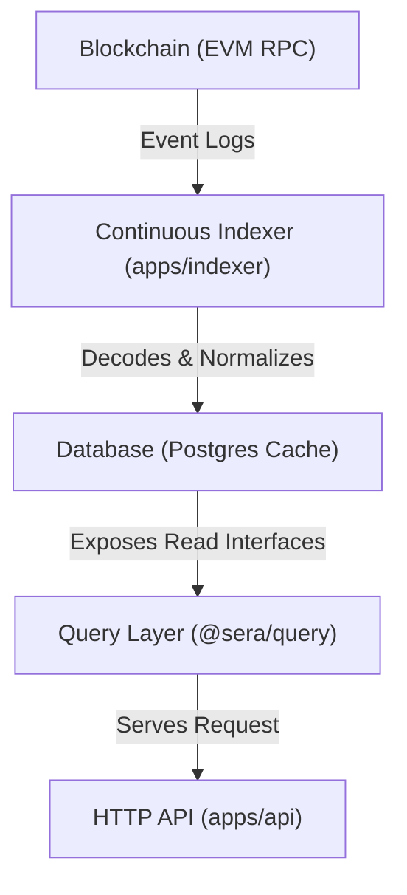

# sera-data

An open-source, deterministic data indexing and read query platform for the **Sera Protocol** built with TypeScript, Node.js 22, pnpm workspaces, and Kysely.

---

## 1. Why `sera-data` Exists

Exposing query access directly to raw blockchain RPC nodes is slow, expensive, and fails to handle block reorganizations (reorgs) cleanly. `sera-data` solves this by building a deterministic, relational database cache from raw blockchain events. It handles reorg safety at the block level and exposes a zero-caching, type-safe query layer to build downstream APIs, analytics, SDKs, and explorers.

---

## 2. Architecture



For more details, see the [High-Level Architecture Guide](docs/architecture.md).

---

## 3. Key Features

- **Replay Invariant**: Wiping the database and running the indexer always recreates the identical state from genesis.
- **Reorg Safety**: Canonicality is tracked at the block level (`block_metadata.is_canonical`). Reads join fact tables with block canonicality to filter out orphaned logs.
- **Dependency Isolation**: Strict layers prevent routing/transport modules from coupling to database Kysely context interfaces.

---

## 4. Quick Start

Get the backing PostgreSQL services and both applications running using Docker Compose:

```bash
# 1. Copy environment template
cp .env.example .env

# 2. Run database, indexer, and API stack
docker compose up --build -d
```

---

## 5. Running Locally (Development)

To run the pipeline and server locally outside of Docker:

```bash
# 1. Boot Postgres database container
docker compose up postgres -d

# 2. Install dependencies & build topological workspaces
pnpm install
pnpm run build

# 3. Start indexer pipeline listener daemon
pnpm --filter @sera/indexer start

# 4. Start HTTP API server
pnpm --filter @sera/api start
```

---

## 6. Project Structure

```
sera-data/
├── apps/
│   ├── api/                 # Reference HTTP Fastify API app
│   └── indexer/             # Event listener and normalizer loop daemon
├── packages/
│   ├── contracts/           # Event decoders, normalizers, and ABIs
│   ├── database/            # Kysely client, migrations, and repositories
│   └── query/               # Stateless read query layer interfaces
└── docs/                    # Architectural decision records and guides
```

---

## 7. Documentation Directory

- [High-Level Architecture](docs/architecture.md)
- [Deployment & Runtime Operations](docs/deployment.md)
- [Query Layer Specification](docs/query-layer.md)
- [HTTP API Reference](docs/http-api.md)
- [Architectural Decision Records (ADRs)](docs/adr/)
- [Release Verification Checklist](docs/release-checklist.md)

---

## 8. Roadmap

- **Milestone 1**: Deterministic Query Layer (Completed)
- **Milestone 2**: Reference HTTP API (Completed)
- **Milestone 3**: Production Runtime & Operations (Completed)
- **Milestone 4**: Open Source Release Engineering (Current)
- **Milestone 5**: Analytics & TVL Accumulator (Future)

---

## 9. Contributing & License

Contributions are welcome! Please read the [Contributing Guidelines](docs/contributing.md) to get started.

Distributed under the Apache 2.0 License.
