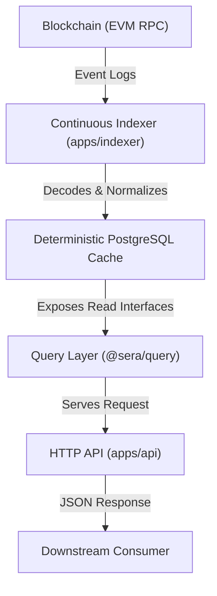

# High-Level Architecture

This document describes the high-level architecture of `sera-data`. The system is designed to provide a highly reliable, deterministic, and replayable indexing engine and read query layer.

---

## 1. System Overview



---

## 2. Core Concepts

### Layer 1 & Layer 2 Data Model
- **Layer 1 (Fact Tables)**: Contains write-once, append-only records representing raw blockchain log parameters (e.g. `raw_deposits`, `raw_trades`).
- **Layer 2 (State & Metadata)**: Stores discovered and computed context information (e.g. `block_metadata`, `token_metadata`, `checkpoints`).

### Replayability & Reorg Safety
- **Replay Invariant**: Since all fact tables are populated solely from decoded blockchain logs, the entire deterministic PostgreSQL cache state can be recreated deterministically from genesis by wiping the cache and running the indexer.
- **Reorg Handling**: If the indexer detects a block reorganization (where a block hash changes for a height that was already indexed), it updates the canonicality status in the deterministic PostgreSQL cache and restarts sync from the common ancestor block.

### Canonicality
- To keep the event fact tables append-only and immutable, we **never** modify fact records during a reorg.
- Canonicality status is tracked strictly at the block level in the `block_metadata` table (`is_canonical`).
- All query layer methods join event tables against `block_metadata` on `(chain_id, block_number, block_hash)` to filter out orphaned blocks' logs dynamically:
  ```sql
  SELECT ... FROM raw_deposits
  INNER JOIN block_metadata ON block_metadata.block_hash = raw_deposits.block_hash
  WHERE block_metadata.is_canonical = true
  ```

---

## 3. Non-Goals

The `sera-data` platform **intentionally does not provide** the following functionalities:

- **No Real-Time State Mutation**: The platform is read-only for external clients. It does not send blockchain transactions or mutate protocol states.
- **No Caching Layer**: We do not maintain in-memory Redis or Application-level caches in the query layer. All reads map directly to deterministic queries.
- **No Complex Analytics / TVL**: The core layers do not compute aggregations like user balances, historical volumes, or TVL (Total Value Locked). These are built by downstream consumer packages.
- **No Transport Specifics in Core**: Decouples query resolution from routing frameworks. Transport layers (HTTP REST, GraphQL, CLI) consume `@sera/query` as a dependency.
