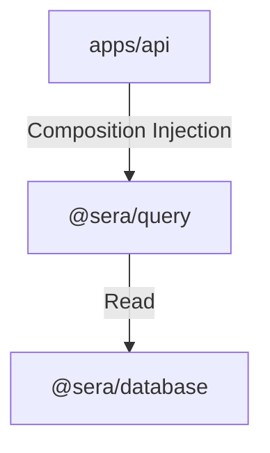

# Reference HTTP API Specification

The `@sera/api` application is a lightweight, stateless HTTP server built using Fastify. It serves as the primary gateway for exposing deterministic protocol read data to downstream consumers (web apps, SDKs, CLI tools, AI agents).

---

## 1. Endpoint Reference

All endpoints return HTTP status codes `200` on success, `400` on validation errors, and `404` when entity is not found.

### Health Status
- **`GET /health`**
  - Response:
    ```json
    {
      "status": "ok",
      "service": "sera-api"
    }
    ```

### Blocks
- **`GET /blocks/latest`**: Fetches the latest canonical block.
- **`GET /blocks/:number`**: Fetches a block by its integer block height.
- **`GET /blocks/hash/:hash`**: Fetches a block by its 32-byte hash.

### Deposits
- **`GET /deposits/:txHash/:logIndex`**: Fetches a canonical deposit log by transaction hash and index.

### Accounts
- **`GET /accounts/:address/deposits`**: Lists all canonical deposits made by the specified account address, sorted newest first.
- **`GET /accounts/:address/trades`**: Lists all canonical limit-order trades involving the specified account address, sorted newest first.

### Tokens
- **`GET /tokens/:address`**: Fetches stored metadata for the specified token contract address.

---

## 2. Dependency Architecture

The API application respects strict package boundaries, consuming only `@sera/query` interfaces via explicit dependency injection.



- **No direct database coupling**: `apps/api` knows nothing about Kysely, Postgres client configurations, pg drivers, or database transaction isolation.
- **No contract details**: `apps/api` contains no ABI decoders, contract addresses, or event Normalization logic.

---

## 3. Design Philosophy & Negative Guarantees

### Why the API remains thin
The API is deliberately designed as a transport-only routing interface. It is thin because:
- **Separation of Concerns**: Transport-specific requirements (like URL routing, serialization, parameter validation, and CORS) are decoupled from query evaluation logic.
- **Upgradability**: If we need to replace Fastify with a different framework or transport layer (like gRPC, GraphQL, or a CLI command), we can do so without altering or re-writing database query operations.
- **Correctness**: Keeps the execution flow deterministic and prevents accidental introduction of side-effects or business logic at the routing layer.

### What the API deliberately does NOT do
To protect the purity of the read layer, `apps/api` does not support:
- **No State Mutations**: Exposes only read-only `GET` endpoints.
- **No Caching**: Contains no HTTP cache headers or memory caches.
- **No Analytics / Aggregations**: Does not calculate user balances, TVL, volume, or historical statistics.
- **No Auth / Sessions**: Authentication, API keys, rate-limiting, and sessions are deferred to gateways or future proxy layers.
