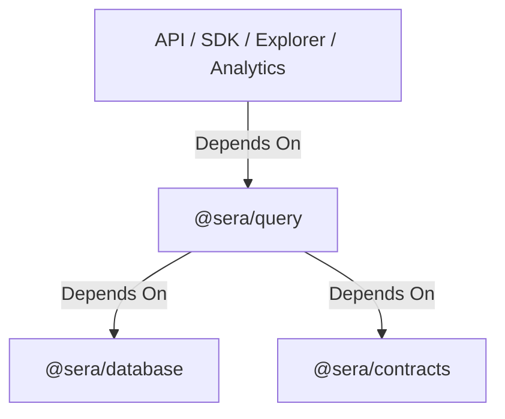

# Read Query Layer Specification

The `@sera/query` package provides a stable, stateless, deterministic, and dependency-inverted read layer over the `sera-data` platform's storage model. It decouples downstream consumers (analytics, APIs, SDKs, explorers) from database implementation details and Kysely.

---

## 1. Package Responsibilities

- **Read-Only**: Serves exclusively as a read gateway to raw facts and metadata.
- **Stateless & Deterministic**: Exposes stateless queries returning data with strict, deterministic newest-first ordering conventions.
- **Canonical Filtering**: Enforces blockchain canonicality checks via automatic joins against the `block_metadata` table, guaranteeing that orphaned blocks/reorged logs are transparently filtered out.
- **Stable API Guarantee**: The public interfaces of `@sera/query` are considered stable. Future changes must be additive whenever possible, avoiding leakage of database implementation details (like Kysely types) that could cause breaking changes later.

---

## 2. Dependency Direction

---

## 3. Supported Query Interfaces & Creator Functions

The package exposes functional areas with explicit interfaces and factory functions:

- **`BlockQueries`** (`createBlockQueries(db)`):
  - `getBlockByHash(chainId, blockHash)`
  - `getBlockByNumber(chainId, blockNumber)`
  - `getLatestCanonicalBlock(chainId)`
- **`DepositQueries`** (`createDepositQueries(db)`):
  - `getDeposit(chainId, txHash, logIndex)`
  - `listDepositsByUser(chainId, userAddress)`
- **`WithdrawalQueries`** (`createWithdrawalQueries(db)`):
  - `getWithdrawal(chainId, txHash, logIndex)`
  - `listWithdrawalsByUser(chainId, userAddress)`
- **`TradeQueries`** (`createTradeQueries(db)`):
  - `getTrade(chainId, txHash, logIndex)`
  - `listTradesByUser(chainId, userAddress)`
- **`MetadataQueries`** (`createMetadataQueries(db)`):
  - `getTokenMetadata(chainId, tokenAddress)`

---

## 4. Architectural Design Rationale

### Why Explicit Query Objects?
We chose explicit query interfaces (e.g. `getBlockByHash`, `listDepositsByUser`) over generic repository patterns (like `find()`, `query()`, or generic search filters). Explicit methods:
- Document specific, index-covered queries directly in the code.
- Prevent consumers from constructing un-indexed or performance-heavy query queries.
- Communicate domain intent clearly.

### Protocol Facts vs. Analytics
The query package intentionally exposes raw protocol facts (immutable blockchain log records) instead of analytics or derived views. Downstream services are responsible for constructing calculations like TVL or user balances on top of these raw facts, leaving the read layer stateless, stable, and highly performant.

---

## 5. Negative Guarantees (Deliberate Non-Goals)

To enforce strict separation of concerns, the `@sera/query` package **deliberately does not implement**:

- **No Joins for Analytics**: No joining of tables to produce complex cross-model analytical aggregates.
- **No Balances or TVL**: Exposes only raw deposits and withdrawals; user token balances and protocol TVL calculations belong to downstream packages.
- **No USD Conversions**: Exchange rates and USD valuations are computed by future analytics packages and are not cached or stored here.
- **No Caching**: Contains no memory or Redis caching logic.
- **No Business Logic**: Contains zero protocol rules or validation constraints.
- **No Metadata Enrichment**: Decoupled from RPC client queries or metadata pipeline tasks.
- **No Pagination Framework**: Cursor-based pagination is excluded to keep interfaces minimal until real consumers require it.
