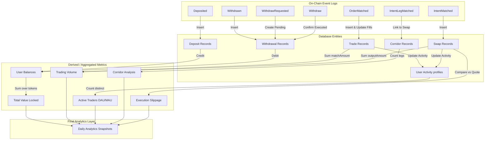

# Canonical Event Catalog: Sera Protocol

This document serves as the canonical event catalog and indexing specification for the Sera Protocol analytics platform. It defines how on-chain logs are mapped to database entities, their utility in generating analytics, and the dependency pipelines required for historical replays.

---

## 1. Smart Contract Directory

| Contract Name | Deployed Address (Mainnet) | Purpose |
| :--- | :--- | :--- |
| **Vault** | `0xC7d4Fd2638e6630C8C61329878676b88A8A24D43` | Asset custody and per-user ledger balance management. Separates custody from matching logic to enable gas-efficient, off-chain matched execution. |
| **Sera** | `0xB5C50C5D5f038404F85970b7f5B7259C4AC0E198` | Core settlement contract. Validates EIP-712 order signatures, matches reciprocities, debit/credits Vault balances, and handles standard and emergency withdrawals. |
| **SeraSOR** | `0xa7A0cf7cd6f043fCA23f29d8ae5aae6b46e11c18` | Smart Order Router. Directs multi-leg instant swaps atomically across virtual liquidity pools and logs intermediate legs. |
| **SeraBatcher** | `0x1f4b366f4145A92978df4bEeb6BdE71bC652F034` | Batch executor wrapper. Groups multiple matches and swap intents, handling atomic failures gracefully without halting the whole transaction block. |

---

## 2. Event Specifications

### Vault.sol

#### 1. `Deposited`
*   **Full Signature:** `event Deposited(address indexed token, address indexed user, uint256 amount)`
*   **Parameter List:**
    *   `address indexed token`: The contract address of the ERC-20 token deposited.
    *   `address indexed user`: The address of the user wallet depositing funds.
    *   `uint256 amount`: The raw amount of tokens deposited (in base units).
*   **Indexed Parameters:** `token`, `user`
*   **Description:** Emitted when tokens are pulled into the Vault from a user's wallet.
*   **Indexer Action:** **Yes** (Index).
*   **Utility:** Critical for tracking user-level deposits, TVL calculations, and initial wallet activation metrics.
*   **Database Entity Mapping:** Maps to the `deposits` table.
*   **Triggers Analytics:** **Yes** (Increments TVL, user deposit history, DAU activity).
*   **Replay Determinism:** **Yes**. The raw amounts and block parameters are immutable. USD conversions require historical token price lookups at the block timestamp.

#### 2. `Withdrawn`
*   **Full Signature:** `event Withdrawn(address indexed token, address indexed user, uint256 amount)`
*   **Parameter List:**
    *   `address indexed token`: The contract address of the ERC-20 token withdrawn.
    *   `address indexed user`: The address of the user wallet receiving the funds.
    *   `uint256 amount`: The raw amount of tokens withdrawn (in base units).
*   **Indexed Parameters:** `token`, `user`
*   **Description:** Emitted when tokens are sent from the Vault back to the user's wallet.
*   **Indexer Action:** **Yes** (Index).
*   **Utility:** Critical for tracking user-level withdrawals and TVL reductions.
*   **Database Entity Mapping:** Maps to the `withdrawals` table (with standard withdrawal type).
*   **Triggers Analytics:** **Yes** (Decrements TVL, updates user statistics, DAU activity).
*   **Replay Determinism:** **Yes**.

---

### Sera.sol

#### 1. `OrderMatched`
*   **Full Signature:** `event OrderMatched(bytes32 indexed orderHash0, address indexed user0, address token0, uint256 amount0, uint256 protocolTake0, bytes32 indexed orderHash1, address user1, address token1, uint256 amount1, uint256 protocolTake1)`
*   **Parameter List:**
    *   `bytes32 indexed orderHash0`: Hash of the first matched order (Maker or Taker 0).
    *   `address indexed user0`: Wallet address of the first user.
    *   `address token0`: Token address sold by user0 (bought by user1).
    *   `uint256 amount0`: Amount of token0 filled in this match.
    *   `uint256 protocolTake0`: Protocol fee taken from user0's proceeds (in token0 units).
    *   `bytes32 indexed orderHash1`: Hash of the second matched order (Maker or Taker 1).
    *   `address user1`: Wallet address of the second user.
    *   `address token1`: Token address sold by user1 (bought by user0).
    *   `uint256 amount1`: Amount of token1 filled in this match.
    *   `uint256 protocolTake1`: Protocol fee taken from user1's proceeds (in token1 units).
*   **Indexed Parameters:** `orderHash0`, `user0`, `orderHash1`
*   **Description:** Emitted when the executor matches two overlapping limit orders and updates their Vault balances internally.
*   **Indexer Action:** **Yes** (Index).
*   **Utility:** The absolute source of truth for volume, pricing (rate = amount0/amount1), trade execution events, and protocol fees.
*   **Database Entity Mapping:** Maps to the `trades` table and triggers linkage records in `order_fills`.
*   **Triggers Analytics:** **Yes** (Updates Trading Volume, Trade Counts, Protocol Revenue, Market Prices, Active Traders).
*   **Replay Determinism:** **Yes**.

#### 2. `InstantWithdraw`
*   **Full Signature:** `event InstantWithdraw(address indexed user, uint256 indexed uuid, address indexed token, uint256 amount, address recipient)`
*   **Parameter List:**
    *   `address indexed user`: The user who signed the withdrawal intent.
    *   `uint256 indexed uuid`: The unique replay protection identifier.
    *   `address indexed token`: Token address being withdrawn.
    *   `uint256 amount`: Amount of tokens withdrawn.
    *   `address recipient`: Address receiving the tokens (usually the same as user).
*   **Indexed Parameters:** `user`, `uuid`, `token`
*   **Description:** Emitted when a user executes a standard withdrawal via the off-chain relayer using a dual-signature.
*   **Indexer Action:** **Yes** (Index).
*   **Utility:** Identifies standard withdrawals and links them to off-chain request tracking. Prevents indexing duplicate standard withdrawals as emergency actions.
*   **Database Entity Mapping:** Maps to the `withdrawals` table (with type = `instant`).
*   **Triggers Analytics:** **Yes** (Updates user statistics, withdrawal logs).
*   **Replay Determinism:** **Yes**.

#### 3. `WithdrawRequested`
*   **Full Signature:** `event WithdrawRequested(address indexed user, address indexed token, uint256 amount, uint256 indexed requestBlock)`
*   **Parameter List:**
    *   `address indexed user`: Address of the user requesting an emergency withdrawal.
    *   `address indexed token`: Token address to be withdrawn.
    *   `uint256 amount`: Amount of tokens requested.
    *   `uint256 indexed requestBlock`: Block height at which the request was registered.
*   **Indexed Parameters:** `user`, `token`, `requestBlock`
*   **Description:** Emitted during the first step of an emergency withdrawal. Initiates the 24-hour security time-lock.
*   **Indexer Action:** **Yes** (Index).
*   **Utility:** Tracks system stress levels. A surge in emergency withdrawal requests flags API downtime or user panic.
*   **Database Entity Mapping:** Maps to the `withdrawals` table (creates a record with status = `pending_timelock` and type = `emergency`).
*   **Triggers Analytics:** **Yes** (Updates security/stress logs).
*   **Replay Determinism:** **Yes**.

#### 4. `Withdraw`
*   **Full Signature:** `event Withdraw(address indexed token, address indexed to, uint256 amount)`
*   **Parameter List:**
    *   `address indexed token`: Token address withdrawn.
    *   `address indexed to`: Destination address.
    *   `uint256 amount`: Amount transferred out of the contract.
*   **Indexed Parameters:** `token`, `to`
*   **Description:** Emitted when an emergency withdrawal is finalized on-chain (step two of the emergency withdrawal flow).
*   **Indexer Action:** **Yes** (Index).
*   **Utility:** Updates the status of an emergency withdrawal from pending to executed.
*   **Database Entity Mapping:** Updates `withdrawals` (finds the pending record matching user/token and updates status = `executed`).
*   **Triggers Analytics:** **Yes** (Decrements TVL, updates withdrawal logs).
*   **Replay Determinism:** **Yes**.

---

### SeraSOR.sol

#### 1. `IntentMatched`
*   **Full Signature:** `event IntentMatched(bytes32 indexed intentHash, address indexed taker, uint256 legCount)`
*   **Parameter List:**
    *   `bytes32 indexed intentHash`: Unique EIP-712 hash of the routed swap intent.
    *   `address indexed taker`: Address of the user requesting the swap.
    *   `uint256 legCount`: Number of intermediate hops/legs in the route.
*   **Indexed Parameters:** `intentHash`, `taker`
*   **Description:** Emitted when a multi-leg smart order routed swap is successfully executed.
*   **Indexer Action:** **Yes** (Index).
*   **Utility:** Primary trigger for processing swaps, routing count metrics, and identifying takers.
*   **Database Entity Mapping:** Maps to the `swaps` table.
*   **Triggers Analytics:** **Yes** (Increments Swap Volume, Swap Counts, DAU activity).
*   **Replay Determinism:** **Yes**.

#### 2. `IntentLegMatched`
*   **Full Signature:** `event IntentLegMatched(bytes32 indexed intentHash, uint256 indexed legIndex, bytes32 takerOrderHash, bytes32 makerOrderHash)`
*   **Parameter List:**
    *   `bytes32 indexed intentHash`: Reference to the parent swap intent.
    *   `uint256 indexed legIndex`: Zero-based index of this specific routing leg.
    *   `bytes32 takerOrderHash`: Order hash representing the taker's side of this leg.
    *   `bytes32 makerOrderHash`: Order hash representing the maker's side of this leg.
*   **Indexed Parameters:** `intentHash`, `legIndex`
*   **Description:** Emitted for each route leg in a multi-hop swap execution.
*   **Indexer Action:** **Yes** (Index).
*   **Utility:** Reconstructs the exact routing path (e.g., EURC -> USDC -> JPYC) to analyze corridor liquidity and routing path performance.
*   **Database Entity Mapping:** Maps to the `swaps` JSONB path field or a separate `swap_legs` table.
*   **Triggers Analytics:** **Yes** (Updates corridor volume distribution).
*   **Replay Determinism:** **Yes**.

---

### SeraBatcher.sol

#### 1. `BatchExecuted`
*   **Full Signature:** `event BatchExecuted(uint256 attempted, uint256 failedMask)`
*   **Parameter List:**
    *   `uint256 attempted`: Total number of matches/swaps attempted in the batch.
    *   `uint256 failedMask`: Bitmask representing index failures.
*   **Indexed Parameters:** None.
*   **Description:** Emitted when the batcher completes a set of trades.
*   **Indexer Action:** **No** (Do not index).
*   **Utility:** Operational health diagnostic only. The specific execution outcomes are already captured by `OrderMatched` or other fail events.
*   **Database Entity Mapping:** None.
*   **Triggers Analytics:** **No**.

#### 2. `MatchFailed`
*   **Full Signature:** `event MatchFailed(bytes32 indexed orderHash0, bytes32 indexed orderHash1, bytes reason, uint256 indexed batchIndex)`
*   **Parameter List:**
    *   `bytes32 indexed orderHash0`: Hash of the first order in the match.
    *   `bytes32 indexed orderHash1`: Hash of the second order in the match.
    *   `bytes reason`: Revert error reason byte string.
    *   `uint256 indexed batchIndex`: Position of this match in the execution queue.
*   **Indexed Parameters:** `orderHash0`, `orderHash1`, `batchIndex`
*   **Description:** Emitted when a non-atomic matched trade fails execution inside a batch.
*   **Indexer Action:** **Yes** (Optional/Diagnostic).
*   **Utility:** Helpful for debugging matching engine errors or identifying execution bottlenecks (e.g. front-running, balance changes).
*   **Database Entity Mapping:** Maps to a `failed_matches` or logs table.
*   **Triggers Analytics:** **No**.
*   **Replay Determinism:** **Yes**.

#### 3. `AtomicBatchExecuted`
*   **Full Signature:** `event AtomicBatchExecuted(uint256 matchCount)`
*   **Parameter List:**
    *   `uint256 matchCount`: Number of matches successfully processed in the atomic block.
*   **Indexed Parameters:** None.
*   **Description:** Emitted when a fully atomic batch completes.
*   **Indexer Action:** **No**.
*   **Utility:** Low utility. Individual fills are already indexed via `OrderMatched`.
*   **Database Entity Mapping:** None.
*   **Triggers Analytics:** **No**.

#### 4. `AtomicBatchFailed`
*   **Full Signature:** `event AtomicBatchFailed(uint256 batchIndex, bytes reason)`
*   **Parameter List:**
    *   `uint256 batchIndex`: Position of the failing batch in the transaction queue.
    *   `bytes reason`: Revert string.
*   **Indexed Parameters:** None.
*   **Description:** Emitted when a batch execution reverted.
*   **Indexer Action:** **No** (Ignore).
*   **Utility:** Diagnostics only.

#### 5. `IntentFailed`
*   **Full Signature:** `event IntentFailed(uint256 indexed intentIndex, bytes reason)`
*   **Parameter List:**
    *   `uint256 indexed intentIndex`: Queue position of the failed intent.
    *   `bytes reason`: Revert string.
*   **Indexed Parameters:** `intentIndex`
*   **Description:** Emitted when an intent routing fails during batch settlement.
*   **Indexer Action:** **No** (Ignore).
*   **Utility:** Operational diagnostics only.

---

## 3. Event-to-Entity Dependency Graph

The following graph illustrates how raw on-chain events flow through the indexer pipeline to construct entities and derived analytics.

---

## 4. Ingestion & Analysis Priority

### 1. MVP Critical Events (High Priority)
These events must be indexed immediately to support a minimum viable dashboard (TVL, Volume, Active Users):
1.  **`Vault.Deposited`**: Required to track collateral entries and TVL base.
2.  **`Vault.Withdrawn`**: Required to track collateral exits and net TVL.
3.  **`Sera.OrderMatched`**: Required to calculate limit order volumes and execution prices.
4.  **`SeraSOR.IntentMatched`**: Required to calculate routed swap volumes.
5.  **`Sera.Withdraw`**: Required to record the execution of emergency withdrawals and update TVL.

### 2. Events that Can Be Ignored Initially (Low Priority)
These events are not required for core metric calculations and can be added later for diagnostics or advanced features:
1.  **`SeraBatcher.BatchExecuted`**: Purely operational diagnostic metrics.
2.  **`SeraBatcher.MatchFailed`**: Can be used to study trade matching failure statistics, but does not impact historical calculations.
3.  **`SeraBatcher.AtomicBatchExecuted` / `AtomicBatchFailed`**: Individual trades inside the batch are already logged via `OrderMatched`.
4.  **`SeraBatcher.IntentFailed`**: Not required for volume or TVL.

### 3. Information Missing from On-Chain Logs (Requires REST API)
Certain metadata never hits the Ethereum blockchain because it represents off-chain state. The indexer must query the REST API to capture:
1.  **Order Cancellations:** When a user cancels a limit order off-chain before it matches, no on-chain event is generated. The indexer must poll `/orders` or listen to cancellation updates to mark the status of `orders_raw` as `cancelled`.
2.  **Order Expirations:** Orders that reach their deadline without being matched simply expire. This is an off-chain timestamp check. The database sync daemon must mark these as `expired`.
3.  **Unfilled Limit Orders:** The state and size of the current order book depth (outstanding bids and asks) are entirely off-chain. Only execution fills go on-chain.
4.  **Token/Market Setup Details:** The names, symbols, and decimals of newly registered stablecoins are requested via `/tokens` and `/markets`.
5.  **Expected Route Slippage Quotes:** To compute slippage, the backend must save the quote output amount requested by the user from `POST /swap/quote` off-chain, and then compare it to the actual on-chain output amount recorded in `IntentMatched` when the transaction settles.

### 4. Ambiguities & Undocumented Source-Code Verification Items
Before finalizing the indexer code, the following items must be verified by auditing the smart contract source code:
1.  **Dual-Signature Instant Withdrawals vs. Vault `Withdrawn` Event:**
    *   *Ambiguity:* Does `Sera.executeInstantWithdrawDualSig(...)` emit `InstantWithdraw` on `Sera.sol` AND call `Vault.withdraw(...)` which emits `Withdrawn` on `Vault.sol`?
    *   *Why it matters:* If both are emitted, the indexer must avoid double-counting the withdrawal in the database. It should either ignore `InstantWithdraw` for TVL math (relying only on Vault's `Withdrawn`), or use `InstantWithdraw` to enrich the `Withdrawn` records.
2.  **SeraSOR Leg Matching Events:**
    *   *Ambiguity:* Does `SeraSOR.sol` emit `IntentLegMatched` for every leg, and does each leg trigger an internal Vault balance update that emits an event?
    *   *Why it matters:* If internal ledger updates inside the SOR trigger events on `Sera.sol` or `Vault.sol`, they could be misclassified as standard limit order fills. The indexer must distinguish between routed internal matches and public CLOB limit order matches.
3.  **Protocol Fee Destinations:**
    *   *Ambiguity:* When `protocolTake0` or `protocolTake1` is deducted in `OrderMatched`, are these fees transferred directly to a fee-collector wallet (triggering a `Withdrawn` or transfer event), or do they accumulate as a ledger balance within the Vault under a protocol-owned address?
    *   *Why it matters:* Crucial for tracking where fees reside and ensuring protocol TVL aggregates do not count collected fees as user-owned trading collateral.
4.  **Emergency Withdrawal finalization:**
    *   *Ambiguity:* Does the second call to `emergencyWithdraw` in `Sera.sol` emit a `Withdraw` event on `Sera.sol` AND call `Vault.withdraw(...)`?
    *   *Why it matters:* Similar to the dual-signature case, we must verify event emissions to prevent double-counting.
