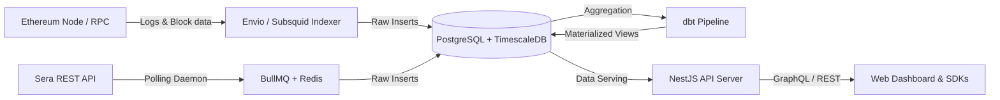
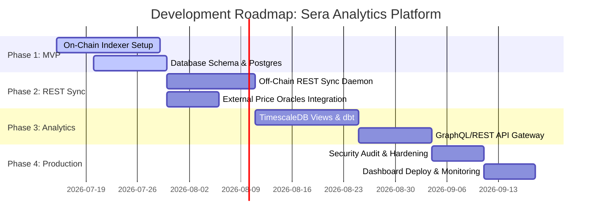

# Technical Design Document: Sera Protocol Analytics Platform

This document serves as a comprehensive technical design blueprint for building an open-source analytics platform for the **Sera Protocol**—a multi-currency settlement infrastructure featuring an on-chain Central Limit Order Book (CLOB) on Ethereum.

---

## 1. High-Level Architecture of Sera

The Sera Protocol operates as a hybrid on-chain/off-chain financial system. Price discovery and order matching are conducted off-chain to achieve sub-second execution speeds, while the custody of funds, transaction validation, and final settlement are executed on-chain to guarantee non-custodial security.

```mermaid
graph TB
    subgraph Client Layer
        Trader[Trader / AI Agent]
        API_Client[Developer / Analytics API Client]
    end

    subgraph Off-Chain Layer (Sera Core Services)
        API_Gateway["api.sera.cx (REST API Gateway)"]
        CLOB["Central Limit Order Book & Matching Engine"]
        Executor["Executor Service (Relayer)"]
    end

    subgraph On-Chain Layer (Ethereum Mainnet)
        Vault["Vault.sol (Custody & Ledgers)"]
        Sera["Sera.sol (Settlement & Withdrawals)"]
        SeraSOR["SeraSOR.sol (Smart Order Routing)"]
        SeraBatcher["SeraBatcher.sol (Batch Settlement)"]
    end

    subgraph Analytics Platform (Proposed)
        Indexer["Custom Indexer (Viem + Node.js)"]
        APISync["API Sync Daemon (BullMQ)"]
        DB[(PostgreSQL + TimescaleDB)]
        GraphQL["GraphQL / REST API Gateway"]
    end

    %% Client Interactions
    Trader -->|"1. Places limit orders / Swaps"| API_Gateway
    Trader -->|"Deposits / Direct Withdraws"| Vault
    
    %% Off-chain internal routing
    API_Gateway --> CLOB
    CLOB -->|"Matched orders"| Executor
    
    %% On-chain settlement
    Executor -->|"2. matchOrders() / executeIntent()"| Sera
    Sera -->|"3. Updates balances"| Vault
    Executor -->|"executeIntent() via routes"| SeraSOR
    SeraSOR --> Vault
    
    %% Indexer / Analytics pipeline
    Indexer -->|"Reads Logs / State"| On-Chain
    APISync -->|"Polls Order/Fill status"| API_Gateway
    Indexer --> DB
    APISync --> DB
    GraphQL --> DB
    API_Client -->|"Queries metrics"| GraphQL
```

### On-Chain vs. Off-Chain Separation

*   **On-Chain Components (Ethereum):**
    *   **Asset Custody (`Vault.sol`):** Holds all ERC-20 tokens deposited by users. It maintains an internal ledger (`balanceOf`) tracking each wallet's non-custodial balance.
    *   **Trade Settlement (`Sera.sol`):** Verifies order signatures, ensures matching criteria are met (token symmetry, price validation, expirations), updates internal ledger balances in `Vault.sol` atomically, and prevents replay attacks using UUID tracking.
    *   **Multi-Leg Routing (`SeraSOR.sol`):** Handles complex, multi-leg instant swaps (e.g., swapping JPY stablecoins to GBP stablecoins via a USD stablecoin pool) within a single atomic Ethereum transaction.
    *   **Batching (`SeraBatcher.sol`):** Groups multiple match and swap executions into a single transaction to optimize gas costs.
*   **Off-Chain Components (Sera Infrastructure):**
    *   **Order Matching Engine:** Maintains the Central Limit Order Book (CLOB). It matches overlapping bids and asks off-chain.
    *   **REST API Gateway (`api.sera.cx`):** Exposes endpoints for traders to query order books, fetch active markets, query balances, request instant swap quotes, and submit cryptographically signed orders.
    *   **Keepers / Executors:** Off-chain services monitored by the protocol that pick up matched orders from the engine, package them with their corresponding EIP-712 signatures, and submit them to Ethereum via `Sera.sol` or `SeraBatcher.sol`.

### Core Flows

#### 1. Deposits
1.  The user approves the `Vault.sol` contract to spend their stablecoins (using standard `approve()` or EIP-2612 `permit()`).
2.  The user calls `deposit(address user, address token, uint256 amount)` on `Vault.sol`.
3.  The contract pulls the tokens and updates the user's on-chain ledger balance, emitting a `Deposited` event.

#### 2. Limit Orders (Trading & Matching)
1.  **Placement:** The user signs an EIP-712 order structure specifying trading parameters (fromToken, toToken, amount, price, expiration, uuid) and submits it via `POST /orders`.
2.  **Matching:** The off-chain engine matches the order against a counterparty.
3.  **Settlement:** An Executor calls `matchOrders(MatchData calldata _match, uint256 deadline)` on `Sera.sol`.
4.  **Ledger Execution:** `Sera.sol` validates both signatures, checks token reciprocity (`order0.fromToken == order1.toToken` and vice versa), and performs an internal ledger transfer within `Vault.sol`. No ERC-20 tokens leave the vault during internal settlement, significantly reducing gas. The transaction emits `OrderMatched` on-chain.

#### 3. Instant Swaps (Fill-or-Kill)
1.  **Quoting:** The user requests a route and price from `POST /swap/quote`.
2.  **Execution:** The user signs an EIP-712 swap intent and submits it.
3.  **On-Chain Route:** The Executor calls `executeIntent(IntentParams calldata params)` on `SeraSOR.sol`.
4.  **Atomic Flow:** The SOR pulls the input tokens directly from the user's wallet (using pre-signed permit approvals), routes them through the required on-chain liquidity legs (swapping internally via Vault ledger updates or external AMMs if integrated), deposits the final output token into the user's wallet, and deducts the gas/service fee from the output token. Emits `IntentMatched` and `IntentLegMatched`.

#### 4. Withdrawals
*   **Instant Withdrawal (Standard):** The user submits a signed withdrawal request. The Executor processes it via `executeInstantWithdrawDualSig(...)` on `Sera.sol`, which validates the user's signature and the platform's signature, debits the ledger, and transfers the ERC-20 tokens back to the user's wallet. Emits `InstantWithdraw` and `Withdrawn`.
*   **Emergency Withdrawal (Platform Offline):** If the API is down, the user bypasses off-chain services:
    1.  Calls `emergencyWithdraw(token, amount)` on `Sera.sol`, emitting `WithdrawRequested`.
    2.  Wait for a 24-hour time-lock (~7,200 Ethereum blocks).
    3.  Calls `emergencyWithdraw(token, amount)` again to execute the transfer from `Vault.sol` back to their wallet, emitting `Withdrawn`.

---

## 2. Smart Contract Analysis

This section analyzes the deployed smart contracts on Ethereum Mainnet that the analytics platform must index.

| Contract Name | Deployed Address | Indexing Priority | Core Responsibility |
| :--- | :--- | :--- | :--- |
| **Vault** | `0xC7d4Fd2638e6630C8C61329878676b88A8A24D43` | **High** | Holds user funds; maintains the internal balances ledger. |
| **Sera** | `0xB5C50C5D5f038404F85970b7f5B7259C4AC0E198` | **Critical** | Processes matched limit orders; manages standard and emergency withdrawals. |
| **SeraSOR** | `0xa7A0cf7cd6f043fCA23f29d8ae5aae6b46e11c18` | **Critical** | Routes and executes instant multi-leg swaps. |
| **SeraBatcher** | `0x1f4b366f4145A92978df4bEeb6BdE71bC652F034` | **Medium** | Batches multiple matches and swap intents into single transactions. |

### Critical Emitted Events to Index

#### 1. Vault.sol
*   **`Deposited(address indexed token, address indexed user, uint256 amount)`**
    *   *Why it matters:* Tracks TVL inflows, user deposits, and initial capital deployments.
*   **`Withdrawn(address indexed token, address indexed user, uint256 amount)`**
    *   *Why it matters:* Tracks TVL outflows and capital withdrawals.

#### 2. Sera.sol
*   **`OrderMatched(bytes32 indexed orderHash0, address indexed user0, address token0, uint256 amount0, bytes32 indexed orderHash1, address indexed user1, address token1, uint256 amount1, uint256 matchAmount0, uint256 matchAmount1)`**
    *   *Why it matters:* The primary source of truth for limit order trade volume, counterparty analysis, execution prices, and settlement metrics.
*   **`InstantWithdraw(address indexed user, uint256 indexed uuid, address indexed token, uint256 amount)`**
    *   *Why it matters:* Monitors standard, user-initiated withdrawals processed through the off-chain relayer.
*   **`WithdrawRequested(address indexed user, address indexed token, uint256 amount, uint256 indexed requestBlock)`**
    *   *Why it matters:* Crucial for tracking panic metrics or system stress, as it flags emergency withdrawal initialization.

#### 3. SeraSOR.sol
*   **`IntentMatched(bytes32 indexed intentHash, address indexed taker, uint256 legCount)`**
    *   *Why it matters:* Tracks completed swap transactions, user address (taker), and route complexity.
*   **`IntentLegMatched(bytes32 indexed intentHash, address indexed user, address inputToken, address outputToken, uint256 inputAmount, uint256 outputAmount)`**
    *   *Why it matters:* Captures specific steps in multi-leg swaps. Used to calculate volume per currency pair, intermediate routing hops, and price slippage.

#### 4. SeraBatcher.sol
*   **`BatchExecuted(uint256 attempted, uint256 failedMask)`**
    *   *Why it matters:* Tracks executor performance and the success rate of batched transactions.
*   **`BatchFailure(bytes32 indexed orderHash0, bytes32 indexed orderHash1, bytes reason, uint256 indexed batchIndex)`**
    *   *Why it matters:* Monitors failure reasons (e.g., price movement, lack of balances) to analyze protocol friction.

---

## 3. REST API Analysis

The Sera REST API (`https://api.sera.cx/api/v1`) serves as the gateway to the off-chain order book and configuration states. Below is an analysis of its endpoints from an analytics perspective.

### Core Endpoints & Analytics Utility

| Method | Endpoint | Data Exposed | Analytics Usefulness / Action |
| :--- | :--- | :--- | :--- |
| **GET** | `/tokens` | List of whitelisted tokens, decimals, addresses. | **High**: Bootstraps token metadata for the database. |
| **GET** | `/markets` | Active trading pairs, minimum trade sizes, price step tick sizes. | **High**: Bootstraps the market registry in the database. |
| **GET** | `/config` | Active smart contract addresses, chain ID, executor public keys. | **High**: Dynamic contract detection (avoids hardcoding addresses). |
| **GET** | `/orders` | User-specific limit orders (active, filled, canceled, expired). | **Critical**: Syncs order lifecycle states that *never* go on-chain (e.g., cancellations, expirations, unfilled order depth). |
| **GET** | `/fills` | List of execution fills for orders. | **Medium**: Off-chain fill metadata check; however, on-chain events are preferred. |
| **GET** | `/balances` | Off-chain synced Vault balances of a user. | **Low**: For display only; on-chain `Vault.balanceOf()` is the absolute source of truth. |
| **POST**| `/swap/quote` | Potential route path, exchange rate, and fee estimate. | **High**: Can be polled periodically by a daemon to capture quoted rates vs. executed rates (slippage analytics). |

### What NOT to Rely Upon (On-Chain Equivalents)

To maintain cryptographic trust and avoid syncing errors, the analytics platform must categorize certain API endpoints as **secondary** or **untrusted** for core metrics:

1.  **`/balances`**: Do not use this to compute TVL or verify user net worth. A bug in the off-chain database or API sync could report incorrect balances. Always query the on-chain `Vault` state.
2.  **`/fills`**: Do not use to calculate settled volume. If the API database drops a record, or if a trade is settled on-chain but the off-chain sync fails, the volume will be underreported. Use on-chain `OrderMatched` and `IntentMatched` events.
3.  **`/health` or `/system/time`**: Useful for monitoring infrastructure availability, but contains no trading metrics.

---

## 4. Data Source Classification

To construct a robust analytics pipeline, we classify the incoming data based on its source, ingestion method, update frequency, and importance.

| Data Type | Primary Source | Ingestion Method | Update Frequency | Why it Matters (Analytics Value) |
| :--- | :--- | :--- | :--- | :--- |
| **Contract Deployments** | REST `/config` | API Poll / Config load | On startup / changes | Configures event listener filters; dynamically adapts to contract upgrades. |
| **Token & Market Catalog**| REST `/tokens`, `/markets` | API Poll | Hourly | Translates raw addresses into human-readable symbols (USD, EUR) and tick sizes. |
| **Deposits & Withdrawals**| On-chain events (`Vault.sol`) | RPC Event Log Filter | Real-time (per block) | Drives TVL metrics, net capital flows, and flags emergency escape hatches. |
| **Limit Order Matches** | On-chain events (`Sera.sol`) | RPC Event Log Filter | Real-time (per block) | The absolute source of truth for settled trading volume, gas efficiency, and fees. |
| **Instant Swaps** | On-chain events (`SeraSOR.sol`)| RPC Event Log Filter | Real-time (per block) | Calculates swap volume, cross-currency routing popularity, and protocol revenue. |
| **Unfilled / Canceled Orders**| REST `/orders` | API Poll (per active API key) | Every 10 seconds | Measures order book depth, cancel-to-fill ratios, and trader behavior patterns. |
| **Token Prices (USD)** | External Oracles (Chainlink/Coingecko)| Price Feed API / Oracles | Every 5 minutes | Normalizes volume and TVL across different currencies (EUR, GBP, JPY, SGD) to USD. |
| **Gas Prices & Tx Details**| Ethereum Blocks | RPC `getBlockByNumber` | Real-time (per block) | Tracks settlement latency and net gas costs incurred by Executors. |

---

## 5. Database Design (PostgreSQL Schema)

For an analytics platform handling both transactional relationships (users, tokens, orders) and high-volume, time-series data (trades, fills, TVL snapshots), we propose a **PostgreSQL** database optimized with the **TimescaleDB** extension. TimescaleDB partitions massive tables automatically by time, improving query performance for historical metrics.

```
                  +-------------------+
                  |      tokens       |
                  +-------------------+
                  | PK  token_address |
                  |     symbol        |
                  |     decimals      |
                  +-------------------+
                            | 1
                            |
                            | has many
                            |
                            +---------------------------+
                            |                           |
                            v 1                         v 1
                     +-------------+             +-------------+
                     |   markets   |             |    users    |
                     +-------------+             | PK  address |
                     | PK  id      |             |     created |
                     | FK  base_t  |             +-------------+
                     | FK  quote_t |                    | 1
                     +-------------+                    |
                            | 1                         |
                            |                           | has many
                            | has many                  |
                            |                           +-----------------------+
                            v                           |                       |
                     +-------------+                    v                       v
                     | orders_raw  |             +--------------+        +--------------+
                     +-------------+             |   deposits   |        | withdrawals  |
                     | PK  order_h |             +--------------+        +--------------+
                     | FK  market  |             | PK tx_h + log|        | PK tx_h + log|
                     | FK  user    |             | FK user      |        | FK user      |
                     |     status  |             | FK token     |        | FK token     |
                     +-------------+             +--------------+        +--------------+
                            | 1
                            |
                            | has many
                            |
                            v
                     +-------------+
                     | order_fills |
                     +-------------+
                     | PK  fill_id |
                     | FK  order_h |
                     | FK  trade_id|
                     +-------------+
                            |
                            | belongs to 1
                            |
                            v 1
                     +-------------+             +-------------+
                     |   trades    |             |    swaps    |
                     +-------------+             +-------------+
                     | PK  trade_id|             | PK  intent_h|
                     | FK  token_0 |             | FK  taker   |
                     | FK  token_1 |             | FK  in_tok  |
                     |     timestamp*|           | FK  out_tok |
                     +-------------+             |     timestamp*|
                                                 +-------------+
                                             *TimescaleDB Hypertable
```

### DDL Schema Definition

```sql
-- Enable TimescaleDB extension if available
CREATE EXTENSION IF NOT EXISTS timescaledb CASCADE;

-- 1. Tokens Registry
CREATE TABLE tokens (
    token_address VARCHAR(42) PRIMARY KEY,
    symbol VARCHAR(15) NOT NULL,
    decimals INT NOT NULL,
    is_whitelisted BOOLEAN DEFAULT TRUE,
    created_at TIMESTAMP WITH TIME ZONE DEFAULT CURRENT_TIMESTAMP
);

-- 2. Markets Registry
CREATE TABLE markets (
    id VARCHAR(50) PRIMARY KEY, -- e.g., "USDC-EURC"
    base_token_address VARCHAR(42) REFERENCES tokens(token_address),
    quote_token_address VARCHAR(42) REFERENCES tokens(token_address),
    min_trade_amount NUMERIC(38, 0) NOT NULL,
    price_tick_size NUMERIC(38, 18) NOT NULL,
    created_at TIMESTAMP WITH TIME ZONE DEFAULT CURRENT_TIMESTAMP
);

-- 3. Users Registry
CREATE TABLE users (
    wallet_address VARCHAR(42) PRIMARY KEY,
    first_active_at TIMESTAMP WITH TIME ZONE NOT NULL,
    last_active_at TIMESTAMP WITH TIME ZONE NOT NULL,
    is_restricted BOOLEAN DEFAULT FALSE -- compliance flag
);

-- 4. Deposits (Vault)
CREATE TABLE deposits (
    tx_hash VARCHAR(66) NOT NULL,
    log_index INT NOT NULL,
    block_number BIGINT NOT NULL,
    user_address VARCHAR(42) REFERENCES users(wallet_address),
    token_address VARCHAR(42) REFERENCES tokens(token_address),
    amount NUMERIC(38, 0) NOT NULL,
    amount_usd NUMERIC(18, 6),
    block_timestamp TIMESTAMP WITH TIME ZONE NOT NULL,
    PRIMARY KEY (tx_hash, log_index)
);

-- 5. Withdrawals (Vault/Sera)
CREATE TYPE withdraw_type AS ENUM ('standard', 'instant', 'emergency');
CREATE TYPE withdraw_status AS ENUM ('pending_timelock', 'executed', 'cancelled');

CREATE TABLE withdrawals (
    tx_hash VARCHAR(66) NOT NULL,
    log_index INT NOT NULL,
    block_number BIGINT NOT NULL,
    user_address VARCHAR(42) REFERENCES users(wallet_address),
    token_address VARCHAR(42) REFERENCES tokens(token_address),
    amount NUMERIC(38, 0) NOT NULL,
    amount_usd NUMERIC(18, 6),
    type withdraw_type NOT NULL,
    status withdraw_status NOT NULL DEFAULT 'executed',
    request_block BIGINT, -- Used for emergency withdrawal tracking
    block_timestamp TIMESTAMP WITH TIME ZONE NOT NULL,
    PRIMARY KEY (tx_hash, log_index)
);

-- 6. Trades (Sera.sol matchOrders - Time-Series Hypertable)
CREATE TABLE trades (
    trade_id UUID PRIMARY KEY DEFAULT gen_random_uuid(),
    tx_hash VARCHAR(66) NOT NULL,
    block_number BIGINT NOT NULL,
    order_hash_0 VARCHAR(66) NOT NULL,
    order_hash_1 VARCHAR(66) NOT NULL,
    user_0 VARCHAR(42) REFERENCES users(wallet_address),
    user_1 VARCHAR(42) REFERENCES users(wallet_address),
    token_0 VARCHAR(42) REFERENCES tokens(token_address),
    token_1 VARCHAR(42) REFERENCES tokens(token_address),
    match_amount_0 NUMERIC(38, 0) NOT NULL,
    match_amount_1 NUMERIC(38, 0) NOT NULL,
    price_0_to_1 NUMERIC(38, 18) NOT NULL, -- Computed price
    volume_usd NUMERIC(18, 6) NOT NULL, -- Normalized volume for analytics
    gas_used BIGINT,
    gas_price_gwei NUMERIC(18, 6),
    block_timestamp TIMESTAMP WITH TIME ZONE NOT NULL
);

-- 7. Swaps (SeraSOR.sol - Time-Series Hypertable)
CREATE TABLE swaps (
    intent_hash VARCHAR(66) NOT NULL,
    tx_hash VARCHAR(66) NOT NULL,
    block_number BIGINT NOT NULL,
    taker_address VARCHAR(42) REFERENCES users(wallet_address),
    input_token VARCHAR(42) REFERENCES tokens(token_address),
    output_token VARCHAR(42) REFERENCES tokens(token_address),
    input_amount NUMERIC(38, 0) NOT NULL,
    output_amount NUMERIC(38, 0) NOT NULL,
    volume_usd NUMERIC(18, 6) NOT NULL,
    routing_path JSONB NOT NULL, -- Array of legs executed
    fee_amount NUMERIC(38, 0) NOT NULL, -- Fee collected
    fee_token VARCHAR(42) REFERENCES tokens(token_address),
    block_timestamp TIMESTAMP WITH TIME ZONE NOT NULL,
    PRIMARY KEY (intent_hash, tx_hash)
);

-- 8. Orders Raw (Synced from off-chain REST API)
CREATE TYPE order_status AS ENUM ('active', 'filled', 'partially_filled', 'cancelled', 'expired');

CREATE TABLE orders_raw (
    order_hash VARCHAR(66) PRIMARY KEY,
    user_address VARCHAR(42) REFERENCES users(wallet_address),
    market_id VARCHAR(50) REFERENCES markets(id),
    side VARCHAR(4) CHECK (side IN ('buy', 'sell')),
    price NUMERIC(38, 18) NOT NULL,
    amount NUMERIC(38, 0) NOT NULL,
    filled_amount NUMERIC(38, 0) DEFAULT 0,
    status order_status NOT NULL,
    is_virtual BOOLEAN DEFAULT FALSE, -- Virtual Liquidity flag
    created_at TIMESTAMP WITH TIME ZONE NOT NULL,
    updated_at TIMESTAMP WITH TIME ZONE NOT NULL
);

-- 9. Order Fills Linkage Table
CREATE TABLE order_fills (
    fill_id UUID PRIMARY KEY DEFAULT gen_random_uuid(),
    order_hash VARCHAR(66) REFERENCES orders_raw(order_hash),
    trade_id UUID REFERENCES trades(trade_id),
    amount_filled NUMERIC(38, 0) NOT NULL,
    block_timestamp TIMESTAMP WITH TIME ZONE NOT NULL
);

-- 10. Hourly Token Prices (for USD value conversion)
CREATE TABLE token_prices (
    token_address VARCHAR(42) REFERENCES tokens(token_address),
    price_usd NUMERIC(18, 6) NOT NULL,
    timestamp TIMESTAMP WITH TIME ZONE NOT NULL,
    PRIMARY KEY (token_address, timestamp)
);

-- Convert large tables into TimescaleDB Hypertables (partitioned by block_timestamp / timestamp)
SELECT create_hypertable('trades', 'block_timestamp');
SELECT create_hypertable('swaps', 'block_timestamp');
SELECT create_hypertable('token_prices', 'timestamp');
```

### Explanations & Indexing Strategies

1.  **`trades` & `swaps` Hypertables:** Partitioning these tables by `block_timestamp` prevents index bloat and ensures that queries seeking volume trends over the last 24 hours, 7 days, or 30 days do not scan the entire database.
2.  **`token_prices` Hypertable:** Fast inserts and time-series queries for historic conversion rates.
3.  **Indexes:**
    *   `CREATE INDEX idx_trades_user ON trades(user_0, user_1);` (Accelerates user history dashboards).
    *   `CREATE INDEX idx_orders_status ON orders_raw(status, user_address);` (Speeds up listing active orders).
    *   `CREATE INDEX idx_swaps_tokens ON swaps(input_token, output_token);` (Speeds up corridor volume queries).
    *   `CREATE INDEX idx_order_fills_hash ON order_fills(order_hash);` (Connects execution trades to off-chain orders).

---

## 6. Analytics Layer (Derived Metrics & Tables)

To avoid recalculating metrics on the fly, the database should maintain **Materialized Views** or derived tables updated incrementally (e.g., using `dbt` or TimescaleDB continuous aggregates).

### 1. TVL (Total Value Locked) Snapshots
TVL must be tracked per token and aggregated to total USD.
$$\text{TVL}_{\text{Token}} = \sum (\text{Deposits}) - \sum (\text{Withdrawals})$$

```sql
CREATE MATERIALIZED VIEW daily_tvl_by_token AS
SELECT
    time_bucket('1 day', block_timestamp) AS day,
    token_address,
    SUM(CASE WHEN action = 'deposit' THEN amount ELSE -amount END) as net_amount
FROM (
    SELECT user_address, token_address, amount, block_timestamp, 'deposit' as action FROM deposits
    UNION ALL
    SELECT user_address, token_address, amount, block_timestamp, 'withdrawal' as action FROM withdrawals WHERE status = 'executed'
) combined
GROUP BY day, token_address;
```

### 2. Daily Trading Volume (Split by Type)
Calculates overall daily economic throughput, separating Limit Orders (Sera settlement) from Swaps (SOR settlement).

```sql
CREATE MATERIALIZED VIEW daily_trading_volume AS
SELECT
    time_bucket('1 day', block_timestamp) AS day,
    'limit_order' AS trade_type,
    token_0 AS token_address,
    SUM(volume_usd) AS volume_usd,
    COUNT(*) AS tx_count
FROM trades
GROUP BY day, token_0
UNION ALL
SELECT
    time_bucket('1 day', block_timestamp) AS day,
    'swap' AS trade_type,
    input_token AS token_address,
    SUM(volume_usd) AS volume_usd,
    COUNT(*) AS tx_count
FROM swaps
GROUP BY day, input_token;
```

### 3. Active Traders (DAU / MAU)
Tracks individual user activity profiles to assess protocol adoption.
*   **Daily Active Users (DAU):** Distinct user addresses executing a deposit, withdrawal, trade, or swap in a 24-hour period.
*   **Monthly Active Users (MAU):** Distinct user addresses active in a rolling 30-day window.

### 4. Slippage and Execution Quality (Swaps)
Monitors the execution difference between the price quote requested off-chain and the actual swap completion on-chain:
$$\text{Slippage} = \frac{\text{Expected Output} - \text{Actual Output}}{\text{Expected Output}} \times 100$$

### 5. Settlement Latency
Measures the duration between order submission (`orders_raw.created_at`) and on-chain settlement confirmation (`trades.block_timestamp`). Highly valuable for evaluating the efficiency of Executors.

---

## 7. API Design (GraphQL & REST)

Developers and dashboards require simple, high-throughput interfaces. We propose a primary GraphQL API for flexible querying, alongside REST endpoints for simple integration.

### GraphQL Schema

```graphql
type Token {
  address: String!
  symbol: String!
  decimals: Int!
  isWhitelisted: Boolean!
}

type Market {
  id: String!
  baseToken: Token!
  quoteToken: Token!
}

type Trade {
  id: ID!
  txHash: String!
  blockNumber: Int!
  user0: String!
  user1: String!
  token0: Token!
  token1: Token!
  matchAmount0: String!
  matchAmount1: String!
  price: Float!
  volumeUsd: Float!
  timestamp: String!
}

type VolumePoint {
  timestamp: String!
  volumeUsd: Float!
  txCount: Int!
}

type TvlPoint {
  timestamp: String!
  tvlUsd: Float!
}

type Query {
  markets: [Market!]!
  recentTrades(marketId: String, limit: Int): [Trade!]!
  dailyVolume(marketId: String, days: Int): [VolumePoint!]!
  historicalTvl(tokenAddress: String, days: Int): [TvlPoint!]!
  userStats(address: String!): UserAnalytics!
}

type UserAnalytics {
  walletAddress: String!
  firstActive: String!
  totalVolumeUsd: Float!
  totalTransactions: Int!
  netDepositsUsd: Float!
}
```

### Proposed REST API Endpoints

*   **`GET /api/v1/analytics/overview`**
    *   *Returns:* 24h trading volume, TVL, 24h fees, total active users.
*   **`GET /api/v1/analytics/markets`**
    *   *Returns:* List of active pairs sorted by 24h volume, liquidity depth, and spread.
*   **`GET /api/v1/analytics/corridors`**
    *   *Returns:* Volume distribution by currency pairs (e.g. USD/EUR, GBP/USD) to demonstrate regional settlement concentration.
*   **`GET /api/v1/analytics/users/:address`**
    *   *Returns:* Detailed profile of a user's trading history, current vault balances, and total fees paid.

---

## 8. Technology Stack Recommendation

To build a scalable, performant, and developer-friendly analytics backend, we recommend the following tech stack:



### Core Architecture Components

1.  **Event Listening & On-Chain Indexing:**
    *   **Recommendation: Envio or Subsquid.**
    *   *Why:* Substantially faster than traditional indexers (like The Graph). They compile to Rust/TypeScript and utilize hyper-optimized data pipelines to ingest logs.
    *   *Fallback:* A custom indexer written in TypeScript using **Viem** (via WebSocket subscriptions to RPC block filters) if custom DB schemas need direct coupling with off-chain REST syncs.
2.  **Off-Chain Sync & Task Scheduling:**
    *   **Recommendation: BullMQ + Redis.**
    *   *Why:* Perfect for queue management, distributed task execution, and handling API rate limits. BullMQ schedules the polling tasks for token prices, REST order updates (`/orders`), and configuration checks.
3.  **Database:**
    *   **Recommendation: PostgreSQL with TimescaleDB.**
    *   *Why:* Combines the structured capabilities of relational tables (user accounts, tokens, markets) with the speed of partitioned time-series hyper-tables (trades, TVL records).
4.  **RPC Library:**
    *   **Recommendation: Viem.**
    *   *Why:* Extremely lightweight, fast, and uses modern TypeScript types. Far superior in performance compared to legacy libraries like `ethers.js`.
5.  **Query & Backend Layer:**
    *   **Recommendation: NestJS (TypeScript) + Kysely (ORM/Query Builder).**
    *   *Why:* NestJS provides structured patterns for modular backends. **Kysely** is a type-safe SQL query builder (running directly on Postgres schemas) that avoids the performance overhead and query execution issues associated with traditional ORMs like Prisma when dealing with complex mathematical operations and aggregations.

---

## 9. Development Roadmap



### Milestones Breakdown

#### Milestone 1: On-Chain Ingestion MVP
*   Initialize PostgreSQL + TimescaleDB database schemas.
*   Deploy Envio/Subsquid indexer to filter and parse events (`Deposited`, `Withdrawn`, `OrderMatched`, `IntentMatched`) from the four core contract addresses.
*   Verify that on-chain events populate the database correctly in real-time.

#### Milestone 2: Off-Chain REST Sync & Valuation
*   Build the BullMQ daemon to poll the `/orders` endpoint for cancellations, expirations, and new placements.
*   Integrate a pricing service (e.g., Chainlink or CoinGecko API) to populate the `token_prices` table.
*   Implement conversion logic to populate `amount_usd` and `volume_usd` fields automatically on insert.

#### Milestone 3: Aggregation & Materialization (Analytics Layer)
*   Build dbt or TimescaleDB continuous aggregates to pre-compile hourly and daily metrics.
*   Establish daily TVL calculations, corridor dominance statistics, and active user counters.
*   Validate the math against Etherscan transaction receipts to ensure calculations are correct.

#### Milestone 4: Developer Query Layer (API)
*   Build the NestJS server.
*   Expose the GraphQL schema and build resolvers using Kysely.
*   Develop REST endpoints for rapid overview metrics.
*   Write and publish API documentation for external integration.

#### Milestone 5: Production Deployment & Observability
*   Implement Redis-based rate limiting on API endpoints.
*   Deploy the analytics platform to Kubernetes.
*   Set up Prometheus metrics and a Grafana dashboard monitoring RPC latency, indexer block lag, API request rates, and database memory usage.

---

## 10. Technical Risks & Validation Items

To ensure project success, the backend engineering team must validate the following risks before beginning implementation:

### 1. Polling Latency and API Rate Limits
*   **Risk:** Since Sera does not support public WebSockets, the analytics platform must poll `/orders` and `/swap/quote` repeatedly. This risks hitting rate limits on the public API gateway (`api.sera.cx`) or introducing latency in the order status dashboard.
*   **Mitigation:** Coordinate with the Sera team to whitelist the analytics server's IP, or explore partnering with them to obtain a webhook endpoint/direct Kafka stream access.

### 2. Transaction Reversion and Reorgs
*   **Risk:** Ethereum blocks can reorganize (reorgs). If an event is indexed and stored in the database but the block is subsequently orphaned, our analytics will record phantom trade volumes.
*   **Mitigation:** Use indexers (like Envio or Subsquid) that native-handle block confirmations, or set a block confirmation depth (e.g., 3-5 blocks) before marking a trade as settled in the database.

### 3. Virtual Liquidity Cancellation Syncing
*   **Risk:** Virtual Liquidity allows a single budget to support up to 50 orders. If one order fills, the others are updated or cancelled off-chain. If the database fails to capture these off-chain updates immediately, the system will report stale order book depth.
*   **Mitigation:** Implement a strict, double-checked update hook where any on-chain `OrderMatched` triggers an immediate query to `/orders` for the matching user to sync their remaining virtual limit states.

### 4. Non-Standard Decimals in FX Stablecoins
*   **Risk:** Stablecoins from different issuers have different decimals (e.g. USDC has 6, EURC has 6, some others might have 18). Math errors can result if normalization to USD fails to account for decimals.
*   **Mitigation:** Always use the decimals loaded from the `tokens` catalog table when converting raw contract amounts (`uint256`) to human-readable decimals, and perform all database calculations using PostgreSQL's high-precision `numeric` data type.

### 5. Compliance Address Restrictions
*   **Risk:** On-chain address screening might prevent certain wallets from executing actions, resulting in failed transactions or frozen vault balances.
*   **Mitigation:** Design the database to handle restricted user flags. Exclude restricted address balances from active TVL if those funds are locked or frozen by smart contract mechanics.
